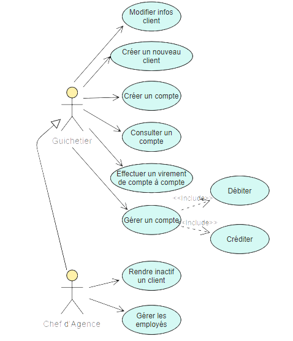
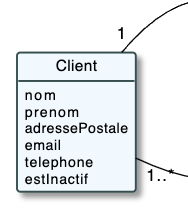
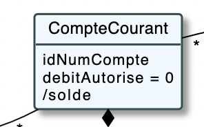
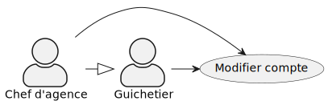
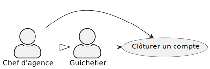
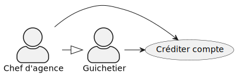
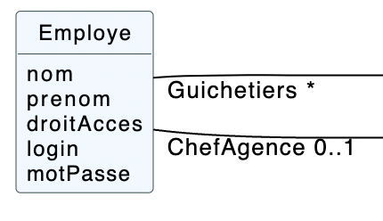

= Documentation Technique - DailyBankApp (V1)
:toc:

Thomas Falsimagne, Tilian Hure, Maxime Dourlent +
*V1* - 05/06/2022

.Répartition des tâches et état d'avancement
[options="header,footer"]
|=======================
|version|user     |use case   |cas...                 |   Maxime DOURLENT | Thomas FALSIMAGNE  |   Tilian HURÉ
|1    |Chef d'Agence    |CRUD employé  |C| | |F
|1    |Chef d'Agence    |CRUD employé  |R| | |F
|1    |Chef d'Agence    |CRUD employé  |U| | |F
|1    |Chef d'Agence    |CRUD employé  |D| | |F
|1    |Guichetier     | Compte | Créer| |F |
|1    |Guichetier     | Compte | Créditer/Débiter|F | |
|1    |Guichetier     | Compte | Effectuer un virement| | |F
|1    |Guichetier     | Compte | Clôturer| |F |
|2    |Chef d'Agence     | Compte | Débit exceptionnel|| |
|2    |Chef d'Agence     | Emprunt | Simuler emprunt|| |
|2    |Chef d'Agence     | Emprunt | Simuler assurance|| |
|2    |Guichetier     | Compte | Relevé PDF|| |
|2    |Guichetier     | CRUD Prélèvement | C||D |
|2    |Guichetier     | CRUD Prélèvement | R||D |
|2    |Guichetier     | CRUD Prélèvement | U||D |
|2    |Guichetier     | CRUD Prélèvement | D||D |
|3    |Bach     | Prélèvement automatiques | || |
|3    |Bach     | Relevé mensuels | || |
|=======================

[.text-justify]
Chaque étudiant doit mettre son nom sur une des colonnes étudiant.
Dans sa colonne il doit remplir la ligne correspondant à une partie qu'il a développé en indiquant F pour "fonctionnel" ou D pour "en développement".

{empty} +

== I. Présentation de l'application
[.text-justify]
L'application DailyBank est destinée à être utilisée par certains employés d'une agence bancaire. Elle permet de gérer des clients, leurs comptes bancaires de dépôt avec leurs opérations, mais aussi des employés tels des guichetiers et des chefs d'agence.

=== 1. Les utilisateurs :
[.text-justify]
L'application peut être utilisée par deux types d'utilisateurs : les guichetiers et les chefs d'agence.

==== A) Use Case V0 :

image::images/uc0.svg[UC0]

==== B) Use Case V1 :

{empty} +
Les *guichetiers* sont les principaux types d'utilisateurs, ils peuvent :

* Créer un nouveau client
* Modifier les informations d'un client
* Consulter les comptes d'un client et leurs opérations
* Débiter le compte d'un client

{empty} +
[.text-justify]
Les *chefs d'agence* sont des "super" guichetiers comparables à des administrateurs. +
Ils peuvent accèder à toutes les mêmes fonctionnalités que les guichetiers, plus :

* Rendre inactif un client

=== 2. Diagramme de classe :

===== A) Diagramme de classe V0 - V1 :

image::images/DC0.svg[DC0]

[.text-justify]
Toutes les données manipulées par l'application sont stockées dans une base de données externes. +
Elles sont structurées de la manière suivante :

* Une *AgenceBancaire* possède des employés, des clients, et gère des comptes courants
* Un *Employe* peut être un guichetier ou un chef d'agence
* Un *Client* possède des comptes courants
* Une *CompteCourant* est composé d'opérations
* Une *Operation* possède un type d'opération

[NOTE]
====
[.text-justify]
Une agence ne peut avoir qu'un seul chef d'agence. Ce dernier peut gérer les clients et les autres employés (guichetiers) de son agence. Il est également le seul à pouvoir rendre un client ou un employé inactif.

{empty} +

[.text-justify]
Les comptes bancaires ne peuvent être clôturés que si leur solde est nulle. Les comptes clôturés ne peuvent plus subir aucune opération mais ces dernières restent tout de même visualisables.

{empty} +

[.text-justify]
Les clients ne peuvent être rendus inactifs que si tous leurs comptes sont clôturés. Les clients inactifs ne peuvent plus être modifiés mais restent tout de même visualisables.

{empty} +

[.text-justify]
Les employés inactifs ne peuvent plus être modifiés mais restent tout de même visualisables. Il n'est plus possible de se connecter à l'application avec leurs identifiants.
====

== II. Architecture

=== 1. Architecture générale :
[.text-justify]
Pour l'application de la banque DailyBank, l'architecture générale est assez simple. Elle est basée sur un fonctionnement centralisé, avec des postes de travails qui sont directement reliés à une base de données.

[.text-justify]
Ces postes de travails sont les ordinateurs où travaillent les employés et les chefs d'agence. Concernant la base de données, elle permet de stocker toutes les informations relatives à l'agence bancaire. Que ce soit les informations des employés, des clients, des comptes et des opérations.

{empty} +

=== 2. Ressources externes :
==== 2.1. Librairies utilisées :
[.text-justify]
Au niveau des librairies, le code de l'application repose sur une seule librairie qui permet de lier l'application à la base de données. Cette librairie est : *objdbc6.jar*

==== 2.2 Exportation de l'application :
[.text-justify]
L'application est disponible à l'exécution et sans prérequis autre qu'une JRE, sous forme de fichier .jar. Elle peut être regénérée à partir du code source et d'un IDE Java, mais ce dernier devra disposer d'une JRE Java versionnée en 1.8 ainsi que de la librairie JavaFX.

[.text-justify]
Pour exécuter l'application en .jar, il faut s'assurer que les postes de travail des employés possèdent également une JRE en 1.8.

{empty} +

=== 3. Structuration de l'application :
==== 3.1 Principe retenu pour la structuration du code :
[.text-justify]
Le code de l'application est structuré en plusieurs packages. Les packages Model, View, Controller et Tools. Le principe qui nous a permis de structurer le code de cette manière est le MCV pattern.

[.text-justify]
Modèle-vue-contrôleur ou MVC est un motif d'architecture logiciel destiné aux interfaces graphiques lancé en 1978 et très populaire pour les applications web. Le motif est composé de trois types de modules ayant trois responsabilités différentes : les modèles, les vues et les contrôleurs.

==== 3.2 Aperçu :
[source]
----
├── application
    │   ├── control
    │   ├── tools
    │   └── view
    └── model
        ├── data
        └── orm
            └── exception
----

===== Package Application :
[.text-justify]
Le package application correspond à la partie View et la partie Controller avec ses deux packages "view" et "control" par rapport au pattern MVC.

*Principaux sous-packages :*

. *control* -> Fichiers permettant d'afficher les différentes fenêtres.
. *tools* -> Fichiers permettant de gérer certaines parties du code.
. *view* -> Controllers des différentes vues (fenêtres) avec les fichiers fxml correspondants.

===== Package Model :
Le package Model correspond à la partie Model du pattern MVC.

*Principaux sous-packages :*

. *data* -> Fichiers représentant les personnes réelles et l'agence bancaire.
. *orm* -> Fichiers permettant la liaison à la base de données et contient également le sous-package Exception contenant les fichiers java permettant de gérer les exceptions

{empty} +

=== 4. Éléments essentiels :
==== 4.1 Prérequis pour le développeur :
[.text-justify]
Si le code de l'application devait être repris pour être amélioré ou modifié, le développeur devra avoir au préalable une *JRE version 1.8*. Il faudra ensuite qu'il ait un environnement de développement adapté pour cette version de Java et un Workspace configuré avec *Java FX* et potentiellement le logiciel *SceneBuilder* pour modifier les fichiers FXML.

[.text-justify]
L'application utilise une *base de données Oracle-SQL* dont le code de déploiement est fourni avec le code source de l'application. Ce dernier pourra être exécuté dans le cas où une autre base de données serait utilisée mais il faudra mettre certaines données à jour dans le code source de l'application qu'il sera nécessaire de regénérer par la suite.

[.text-justify]
Ces données concernent la classe "LogToDatabase.java" du sous-package "orm" du package "model". Les ligne 19 à 24 qui devront être modifiées afin de renseigner les nouvelles données de connexion à la base de données utilisée.

==== 4.2 Lancement de l'application :
[.text-justify]
Le poste sur lequel souhaite être lancée l'application avec le fichier "DailyBankApp.jar", devra préalablement disposer d'une JRE versionné en 1.8.

[NOTE]
====
[.text-justify]
Pour toute information concernant l'installation d'une JRE 1.8, merci de bien vouloir vous référer à la *documentation utilisateur*.
====

[.text-justify]
Avant d'exécuter le fichier .jar, il sera nécessaire de changer l'environnement Java du poste concerné avec celle précédemment mentionnée, une fois installée. Pour cela, un fichier "SETENV.bat" est fourni avec le code source, permettant de momentanément changer de JRE. Éditez son contenu en remplacant le texte entre guillemets de la première ligne par le chemin de la JRE 1.8 du poste concerné, puis sauvegardez les modifications. Pour lancer l'application, vous n'aurez plus qu'à exécuter le fichier .bat pour changer de JRE, avant de faire de même avec le fichier .jar.

== IV. Répartition du travail
[.text-justify]
La charge de travail concernant le développement de l'application et de ses fonctionnalités a été répartie entre les trois membres de l'équipe.

=== 1. Maxime DOURLENT :

*Fonctionnalités développées :*

* Créditer un compte

=== 2. Thomas FALSIMAGNE :

*Fonctionnalités développées :*

* Créer un compte
* Modifier un compte
* Clôturer un compte

=== 3. Tilian HURÉ :

*Fonctionnalités développées :*

* Faire un virement de compte à compte
* Gérer des employés (modification, ajout, visualisation et suppression)
* Visualiser un client
* Rendre inactif un client

== IV. Description et explication des fonctionnalités implémentées
=== 1. Fonctionnalités des guichetiers :
==== 1.1 Créer un client :
Un guichetier peut créer un nouveau client.

===== A) Use case correspondant :
image::images/creerClient.svg[]

===== B) Partie du diagramme de classe correspondante :

[.text-justify]
Cette partie du diagramme de classe est en mise-à-jour, certaines données sont ajoutées dans la base de données.

===== C) Aperçu des principales fonctionnalités :
[.text-justify]
[blue]#Pour ce qui est des fonctionnalités concernant l'ajout ou la modification des informations d'un client, merci de bien vouloir vous référer à la *documentation utilisateur*.#

===== D) Classes et packages impliqués :
. Application/Control -> ClientsManagement.java, ClientEditorPane.java
. Application/View -> ClientEditorPaneController.java, ClientsManagementController.java, clienteditorpane.fxml, clientsmanagement.fxml
. Application/Model/data -> Client.java
. Application/Model/orm -> AccessClient.java

===== E) Éléments essentiels :
====== E.1 - Fonctions :
. insertClient(Client client) -> AccessClient.java
. nouveauClient() -> ClientsManagement.java
. doAjouter() -> ClientEditorPaneController.java
. displayDialog(Client client, EditionMode mode) -> ClientEditorPaneController.java

====== E.2 - Classes :
[.text-justify]
La classe Client.java est importante car principalement utilisée pour modéliser des clients sous forme d'objets manipulables dans le code.

{empty} +

==== 1.2 Modifier les informations d'un client :
[.text-justify]
Un guichetier peut modifier les informations d'un client (son nom, son prénom, son adresse, etc).

===== A) Use case correspondant :
image::images/modifierInfo.svg[]

===== B) Partie du diagramme de classe correspondante :

[.text-justify]
Cette partie du diagramme de classe est en mise-à-jour, certaines données sont modifiées dans la base de donnée.

===== C) Aperçu des principales fonctionnalités :
[.text-justify]
[blue]#Pour ce qui est des fonctionnalités concernant l'ajout ou la modification des informations d'un client, merci de bien vouloir vous référer à la *documentation utilisateur*.#

===== D) Classes et packages impliqués :
. Application/Control -> ClientsManagement.java, ClientEditorPane.java
. Application/View -> ClientEditorPaneController.java, ClientsManagementController.java, clienteditorpane.fxml, clientsmanagement.fxml
. Application/Model/data -> Client.java
. Application/Model/orm -> AccessClient.java

===== E) Éléments essentiels :
====== E.1 - Fonctions :
. modifierClient(Client c) -> ClientsManagement.java
. updateClient(Client client) -> AccessClient.java
. doAjouter() -> ClientEditorPaneController.java
. displayDialog(Client client, EditionMode mode) -> ClientEditorPaneController.java
. doModifierClient() -> ClientsManagementController.java

====== E.2) Classes :
[.text-justify]
La classe Client.java est importante car principalement utilisée pour modéliser des clients sous forme d'objets manipulables dans le code.

{empty} +

==== 1.3 Visualiser les informations d'un client :
[.text-justify]
Un guichetier peut visualiser (en lecture seule) les informations d'un client (son nom, son prénom, son adresse, etc).

===== A) Use case correspondant :

===== B) Partie du diagramme de classe correspondante :

[.text-justify]
Cette partie du diagramme de classe est en lecture, aucune données n'est ajoutée, modifiée ou supprimée dans la base de donnée.

===== C) Aperçu des principales fonctionnalités :
[.text-justify]
[blue]#Pour ce qui est des fonctionnalités concernant l'ajout ou la modification des informations d'un client, merci de bien vouloir vous référer à la *documentation utilisateur*.#

===== D) Classes et packages impliqués :
. Application/Control -> ClientsManagement.java, ClientEditorPane.java
. Application/View -> ClientEditorPaneController.java, ClientsManagementController.java, clienteditorpane.fxml, clientsmanagement.fxml
. Application/Model/data -> Client.java
. Application/Model/orm -> AccessClient.java

===== E) Éléments essentiels :
====== E.1 - Fonctions :
. voirClient(Client client) -> ClientsManagement.java
. displayDialog(Client client, EditionMode mode) -> ClientEditorPaneController.java
. doVoirClient() -> ClientsManagementController.java

====== E-2) Classes :
[.text-justify]
La classe Client.java est importante car principalement utilisée pour modéliser des clients sous forme d'objets manipulables dans le code.

{empty} +

==== 1.4 Créer un compte bancaire :
Un guichetier peut créer un nouveau compte bancaire pour un client.

===== A) Use case correspondant :

===== B) Partie du diagramme de classe correspondante :

[.text-justify]
Cette partie du diagramme de classe est en mise-à-jour, certaines données sont ajoutées dans la base de données.

===== C) Aperçu des principales fonctionnalités :
[.text-justify]
[blue]#Pour ce qui est des fonctionnalités concernant l'ajout ou la modification des informations d'un client, merci de bien vouloir vous référer à la *documentation utilisateur*.#

===== D) Classes et packages impliqués :
. Application/Control -> ComptesManagement.java, CompteEditorPane.java
. Application/View -> CompteEditorPaneController.java, ComptesManagementController.java, compteeditorpane.fxml, comptesmanagement.fxml
. Application/Model/data -> CompteCourant.java
. Application/Model/orm -> AccessCompteCourant.java

===== E) Éléments essentiels :
====== E.1 - Fonctions :
. enregistrerCompte(Compte compte) -> AccessCompteCourant.java
. creerCompte() -> ComptesManagement.java
. doAjouter() -> CompteEditorPaneController.java
. displayDialog(Client client, Compte cpte, EditionMode mode) -> CompteEditorPaneController.java

====== E.2 - Classes :
[.text-justify]
La classe CompteCourant.java est importante car principalement utilisée pour modéliser des comptes bancaires sous forme d'objets manipulables dans le code.

{empty} +

==== 1.5 Modifier les informations d'un compte bancaire :
Un guichetier peut modifier un compte bancaire.

===== A) Use case correspondant :

===== B) Partie du diagramme de classe correspondante :

[.text-justify]
Cette partie du diagramme de classe est en mise-à-jour, certaines données sont modifiées dans la base de données.

===== C) Aperçu des principales fonctionnalités :
[.text-justify]
[blue]#Pour ce qui est des fonctionnalités concernant l'ajout ou la modification des informations d'un client, merci de bien vouloir vous référer à la *documentation utilisateur*.#

===== D) Classes et packages impliqués :
. Application/Control -> ComptesManagement.java, CompteEditorPane.java
. Application/View -> CompteEditorPaneController.java, ComptesManagementController.java, compteeditorpane.fxml, comptesmanagement.fxml
. Application/Model/data -> CompteCourant.java
. Application/Model/orm -> AccessCompteCourant.java

===== E) Éléments essentiels :
====== E.1 - Fonctions :
. modifierCompte(Compte compte) -> AccessCompteCourant.java
. modifierCompte() -> ComptesManagement.java
. doAjouter() -> CompteEditorPaneController.java
. displayDialog(Client client, Compte cpte, EditionMode mode) -> CompteEditorPaneController.java

====== E.2 - Classes :
[.text-justify]
La classe CompteCourant.java est importante car principalement utilisée pour modéliser des comptes bancaires sous forme d'objets manipulables dans le code.

[NOTE]
====
[.text-justify]
Seul le découvert autorisé d'un compte peut être modifié. Ce dernier peut être élargi, en revanche il ne peut devenir infèrieur au solde du compte concerné si ce dernier est négatif.
====

{empty} +

==== 1.5 Consulter un compte bancaire :
Un guichetier peut consulter un compte bancaire.

===== A) Use case correspondant :
image::images/consulterCompte.svg[]

===== B) Partie du diagramme de classe correspondante :

[.text-justify]
Cette partie du diagramme de classe est lecture, aucune données n'est modifiée, ajoutée ou supprimée dans la base de données.

===== C) Aperçu des principales fonctionnalités :
[.text-justify]
Pour ce qui est des fonctionnalités concernant la modification des informations d'un client, merci de bien vouloir vous référer à la documentation utilisateur.

===== D) Classes et packages impliqués :
. Application/Control -> ComptesManagement.java, CompteEditorPane.java
. Application/View -> CompteEditorPaneController.java, ComptesManagementController.java, clienteditorpane.fxml, clientsmanagement.fxml
. Application/Model/Data -> CompteCourant.java
. Application/Model/orm -> AccessCompteCourant.java

===== E) Éléments essentiels :

====== E.1 - Fonctions :
. loadList() -> ComptesManagementController.java
. getCompteCourants(int idNumCli) -> AccessCompteCourant.java
. getCompteCourant(int idNumCompte) -> AccessCompteCourant.java
. displayDialog(Client client, CompteCourant cpte, EditionMode mode) -> CompteEditorPaneController.java
. getComptesDunClient() -> ComptesManagement.java

====== E.2 - Classes :
[.text-justify]
La classe CompteCourant.java est importante car principalement utilisée pour modéliser des comptes bancaires sous forme d'objets manipulables dans le code.

{empty} +

==== 1.6 Clôturer un compte bancaire :
Un guichetier peut clôturer un compte bancaire.

===== A) Use case correspondant :

===== B) Partie du diagramme de classe correspondante :

[.text-justify]
Cette partie du diagramme de classe est en mise-à-jour, certaines données sont modifiées dans la base de données.

===== C) Aperçu des principales fonctionnalités :
[.text-justify]
[blue]#Pour ce qui est des fonctionnalités concernant l'ajout ou la modification des informations d'un client, merci de bien vouloir vous référer à la *documentation utilisateur*.#

===== D) Classes et packages impliqués :
. Application/Control -> ComptesManagement.java, CompteEditorPane.java
. Application/View -> CompteEditorPaneController.java, ComptesManagementController.java, compteeditorpane.fxml, comptesmanagement.fxml
. Application/Model/data -> CompteCourant.java
. Application/Model/orm -> AccessCompteCourant.java

===== E) Éléments essentiels :
====== E.1 - Fonctions :
. cloturerCompte(int idNumCompte) -> AccessCompteCourant.java
. cloturerCompte() -> ComptesManagement.java
. doCloturerCompte() -> ComptesManagementController.java

====== E.2 - Classes :
[.text-justify]
La classe CompteCourant.java est importante car principalement utilisée pour modéliser des comptes bancaires sous forme d'objets manipulables dans le code.

[NOTE]
====
[.text-justify]
Les comptes bancaires ne peuvent être clôturés que si leur solde est nulle. Les comptes clôturés ne peuvent plus subir aucune opération mais ces dernières restent tout de même visualisables.
====

{empty} +

==== 1.7 Débiter un compte :
Un guichetier peut débiter un compte bancaire.

===== A) Use case correspondant :
image::images/debiterCompte.svg[]

===== B) Partie du diagramme de classe correspondante :
image::images/débitCompte.png[]

[.text-justify]
Les parties *CompteCourant* et *TypeOperation* du diagramme de classe sont en lecture, aucune données n'est modifiée, ajoutée ou supprimée de la base de données. La partie *Operation* est en mise-à-jour, certaines données sont ajoutées à la base de donneés.

===== C) Aperçu des principales fonctionnalités :
[.text-justify]
[blue]#Pour ce qui est des fonctionnalités concernant l'enregistrement d'un débit sur un compte bancaire, merci de bien vouloir vous référer à la *documentation utilisateur*.#

===== D) Classes et packages impliqués :
. Application/Control -> OperationManagement.java, OperationEditorPane.java
. Application/View -> OperationEditorPaneController.java, OperationManagementController.java, operationeditorpane.fxml, operationmanagement.fxml
. Application/Model -> CompteCourant.java, Operation.java, TypeOperation.java
. Application/Model/orm -> AccessCompteCourant.java

===== E) Éléments essentiels :
====== E.1 - Fonctions :
. doDebit() -> OperationManagementController.java
. doAjouter() -> OperationEditorPaneController.java
. enregistrerDebit() -> OperationManagement.java
. insertDebit() -> AccessOperation.java
. getTypeOperation() -> AccessTypeOperation.java
. updateInfoCompteClient() -> OperationManagementController.java

====== E.2 - Classes :
[.text-justify]
La classe Operation.java est importante car principalement utilisée pour modéliser des opérations de débit, de crédit ou de virement sous forme d'objets manipulables dans le code.

[NOTE]
====
[.text-justify]
Un débit doit être d'un motant strictement positif (>0) et ne doit pas enfreindre le découvert autorisé pour le compte concerné.
====

{empty} +

==== 1.8 Créditer un compte :
Un guichetier peut créditer un compte bancaire.

===== A) Use case correspondant :

===== B) Partie du diagramme de classe correspondante :
image::images/débitCompte.png[]

[.text-justify]
Les parties *CompteCourant* et *TypeOperation* du diagramme de classe sont en lecture, aucune données n'est modifiée, ajoutée ou supprimée de la base de données. La partie *Operation* est en mise-à-jour, certaines données sont ajoutées à la base de donneés.

===== C) Aperçu des principales fonctionnalités :
[.text-justify]
[blue]#Pour ce qui est des fonctionnalités concernant l'enregistrement d'un débit sur un compte bancaire, merci de bien vouloir vous référer à la *documentation utilisateur*.#

===== D) Classes et packages impliqués :
. Application/Control -> OperationManagement.java, OperationEditorPane.java
. Application/View -> OperationEditorPaneController.java, OperationManagementController.java, operationeditorpane.fxml, operationmanagement.fxml
. Application/Model -> CompteCourant.java, Operation.java, TypeOperation.java
. Application/Model/orm -> AccessCompteCourant.java

===== E) Éléments essentiels :
====== E.1 - Fonctions :
. doCredit() -> OperationManagementController.java
. doAjouter() -> OperationEditorPaneController.java
. enregistrerCredit() -> OperationManagement.java
. insertCredit() -> AccessOperation.java
. getTypeOperation() -> AccessTypeOperation.java
. updateInfoCompteClient() -> OperationManagementController.java

====== E.2 - Classes :
[.text-justify]
La classe Operation.java est importante car principalement utilisée pour modéliser des opérations de débit, de crédit ou de virement sous forme d'objets manipulables dans le code.

[NOTE]
====
[.text-justify]
Un crédit doit être d'un motant strictement positif (>0).
====

{empty} +

==== 1.9 Effectuer un virement de compte à compte :
Un guichetier peut faire un virement d'un compte bancaire à un autre pour un même client.

===== A) Use case correspondant :

===== B) Partie du diagramme de classe correspondante :
image::images/débitCompte.png[]

[.text-justify]
Les parties *CompteCourant* et *TypeOperation* du diagramme de classe sont en lecture, aucune données n'est modifiée, ajoutée ou supprimée de la base de données. La partie *Operation* est en mise-à-jour, certaines données sont ajoutées à la base de donneés.

===== C) Aperçu des principales fonctionnalités :
[.text-justify]
[blue]#Pour ce qui est des fonctionnalités concernant l'enregistrement d'un débit sur un compte bancaire, merci de bien vouloir vous référer à la *documentation utilisateur*.#

===== D) Classes et packages impliqués :
. Application/Control -> OperationManagement.java, OperationEditorPane.java
. Application/View -> OperationEditorPaneController.java, OperationManagementController.java, operationeditorpane.fxml, operationmanagement.fxml
. Application/Model -> CompteCourant.java, Operation.java, TypeOperation.java
. Application/Model/orm -> AccessCompteCourant.java

===== E) Éléments essentiels :
====== E.1 - Fonctions :
. doDebit() -> OperationManagementController.java
. doAjouter() -> OperationEditorPaneController.java
. enregistrerDebit() -> OperationManagement.java
. enregistrerCredit() -> OperationManagement.java
. insertDebit() -> AccessOperation.java
. insertCredit() -> AccessOperation.java
. getTypeOperation() -> AccessTypeOperation.java
. updateInfoCompteClient() -> OperationManagementController.java

====== E.2 - Classes :
[.text-justify]
La classe Operation.java est importante car principalement utilisée pour modéliser des opérations de débit, de crédit ou de virement sous forme d'objets manipulables dans le code.

[NOTE]
====
[.text-justify]
Un virement doit être d'un motant strictement positif (>0) et ne doit pas enfreindre le découvert autorisé pour le compte concerné. Il ne peut être effectués que entre des comptes non-clôturés d'un même client.
====

{empty} +

=== 2. Fonctionnalités des chefs d'agence :
==== 2.1 Rendre inactif un client :
Un chef d'agence peut rendre inactif un client.

===== A) Use case correspondant :

===== B) Partie du diagramme de classe correspondante :

[.text-justify]
Cette partie du diagramme de classe est mise-à-jour, certaines données sont modifiées dans la base de données.

===== C) Aperçu des principales fonctionnalités :
[.text-justify]
[blue]#Pour ce qui est des fonctionnalités concernant la modification, l'ajout, la visualisation et la suppression des informations d'un employé, merci de bien vouloir vous référer à la *documentation utilisateur*.#

===== D) Classes et packages impliqués :
. Application/Control -> ClientsManagement.java, ClientEditorPane.java
. Application/View -> ClientEditorPaneController.java, ClientsManagementController.java, clienteditorpane.fxml, clientsmanagement.fxml
. Application/Model/data -> Client.java
. Application/Model/orm -> AccessClient.java

===== E) Éléments essentiels :
====== E.1 - Fonctions :
. modifierClient(Client c) -> ClientsManagement.java
. updateClient(Client client) -> AccessClient.java
. doAjouter() -> ClientEditorPaneController.java
. displayDialog(Client client, EditionMode mode) -> ClientEditorPaneController.java
. doModifierClient() -> ClientsManagementController.java
. doRendreInactif() -> ClientEditorPaneController.java

====== E.2 - Classes :
[.text-justify]
La classe Client.java est importante car principalement utilisée pour modéliser des clients sous forme d'objets manipulables dans le code.

[NOTE]
====
[.text-justify]
Les clients ne peuvent être rendus inactifs que si tous leurs comptes sont clôturés (voir la fonctionnalité "Clôturer un compte"). Les clients inactifs ne peuvent plus être modifiés mais restent tout de même visualisables.
====

{empty} +

==== 2.2 Créer un employé :
Un chef d'agence peut créer un nouvel employé.

===== A) Use case correspondant :

===== B) Partie du diagramme de classe correspondante :

[.text-justify]
Cette partie du diagramme de classe est en mise-à-jour, certaines données sont ajoutées dans la base de données.

===== C) Aperçu des principales fonctionnalités :
[.text-justify]
[blue]#Pour ce qui est des fonctionnalités concernant l'ajout ou la modification des informations d'un client, merci de bien vouloir vous référer à la *documentation utilisateur*.#

===== D) Classes et packages impliqués :
. Application/Control -> EmployesManagement.java, EmployeEditorPane.java
. Application/View -> EmployeEditorPaneController.java, EmployesManagementController.java, employeeditorpane.fxml, employesmanagement.fxml
. Application/Model/data -> Employe.java
. Application/Model/orm -> AccessEmploye.java

===== E) Éléments essentiels :
====== E.1 - Fonctions :
. insertEmploye(Employe employe) -> AccessEmploye.java
. nouvelEmploye() -> EmployesManagement.java
. doAjouter() -> EmployeEditorPaneController.java
. displayDialog(Employe employe, EditionMode mode) -> EmployeEditorPaneController.java

====== E.2 - Classes :
[.text-justify]
La classe Employe.java est importante car principalement utilisée pour modéliser des employés sous forme d'objets manipulables dans le code.

{empty} +

==== 2.3 Modifier les informations d'un employé :
[.text-justify]
Un chef d'agence peut modifier les informations d'un employé (son nom, son prénom, son login, son mot-de-passe, etc).

===== A) Use case correspondant :

===== B) Partie du diagramme de classe correspondante :

[.text-justify]
Cette partie du diagramme de classe est en mise-à-jour, certaines données sont modifiées dans la base de donnée.

===== C) Aperçu des principales fonctionnalités :
[.text-justify]
[blue]#Pour ce qui est des fonctionnalités concernant l'ajout ou la modification des informations d'un client, merci de bien vouloir vous référer à la *documentation utilisateur*.#

===== D) Classes et packages impliqués :
. Application/Control -> EmployesManagement.java, EmployeEditorPane.java
. Application/View -> EmployeEditorPaneController.java, EmployesManagementController.java, employeeditorpane.fxml, employesmanagement.fxml
. Application/Model/data -> Employe.java
. Application/Model/orm -> AccessEmploye.java

===== E) Éléments essentiels :
====== E.1 - Fonctions :
. updateEmploye(Employe employe) -> AccessEmploye.java
. modifierEmploye() -> EmployesManagement.java
. doAjouter() -> EmployeEditorPaneController.java
. displayDialog(Employe employe, EditionMode mode) -> EmployeEditorPaneController.java

====== E.2 - Classes :
[.text-justify]
La classe Employe.java est importante car principalement utilisée pour modéliser des employés sous forme d'objets manipulables dans le code.

{empty} +

==== 2.4 Visualiser les informations d'un employé :
[.text-justify]
Un chef d'agence peut visualiser (en lecture seule) les informations d'un employé (son nom, son prénom, son login, son mot-de-passe, etc).

===== A) Use case correspondant :

===== B) Partie du diagramme de classe correspondante :

[.text-justify]
Cette partie du diagramme de classe est en lecture, aucune données n'est ajoutée, modifiée ou supprimée dans la base de donnée.

===== C) Aperçu des principales fonctionnalités :
[.text-justify]
[blue]#Pour ce qui est des fonctionnalités concernant l'ajout ou la modification des informations d'un client, merci de bien vouloir vous référer à la *documentation utilisateur*.#

===== D) Classes et packages impliqués :
. Application/Control -> EmployesManagement.java, EmployeEditorPane.java
. Application/View -> EmployeEditorPaneController.java, EmployesManagementController.java, employeeditorpane.fxml, employesmanagement.fxml
. Application/Model/data -> Employe.java
. Application/Model/orm -> AccessEmploye.java

===== E) Éléments essentiels :
====== E.1 - Fonctions :
. voirEmploye() -> EmployesManagement.java
. doVoirEmploye() -> EmployesManagementController.java
. displayDialog(Employe employe, EditionMode mode) -> EmployeEditorPaneController.java

====== E.2 -Classes :
[.text-justify]
La classe Employe.java est importante car principalement utilisée pour modéliser des employés sous forme d'objets manipulables dans le code.

{empty} +

==== 2.5 Rendre inactif un employé :
Un chef d'agence peut rendre inactif un employé.

===== A) Use case correspondant :

===== B) Partie du diagramme de classe correspondante :

[.text-justify]
Cette partie du diagramme de classe est mise-à-jour, certaines données sont modifiées dans la base de données.

===== C) Aperçu des principales fonctionnalités :
[.text-justify]
[blue]#Pour ce qui est des fonctionnalités concernant la modification, l'ajout, la visualisation et la suppression des informations d'un employé, merci de bien vouloir vous référer à la *documentation utilisateur*.#

===== D) Classes et packages impliqués :
. Application/Control -> EmployesManagement.java, EmployeEditorPane.java
. Application/View -> EmployeEditorPaneController.java, EmployesManagementController.java, employeeditorpane.fxml, employesmanagement.fxml
. Application/Model/data -> Employe.java
. Application/Model/orm -> AccessEmploye.java

===== E) Éléments essentiels :
====== E.1 - Fonctions :
. updateEmploye(Employe employe) -> AccessEmploye.java
. modifierEmploye() -> EmployesManagement.java
. doAjouter() -> EmployeEditorPaneController.java
. displayDialog(Employe employe, EditionMode mode) -> EmployeEditorPaneController.java
. doRendreInactif() -> ClientEditorPaneController.java

====== E.2 - Classes :
[.text-justify]
La classe Employe.java est importante car principalement utilisée pour modéliser des employés sous forme d'objets manipulables dans le code.

[NOTE]
====
[.text-justify]
Les employés inactifs ne peuvent plus être modifiés mais restent tout de même visualisables.
====
