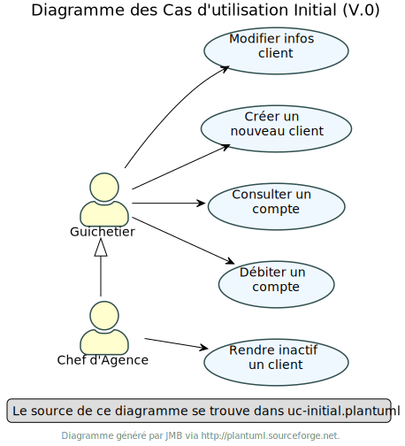
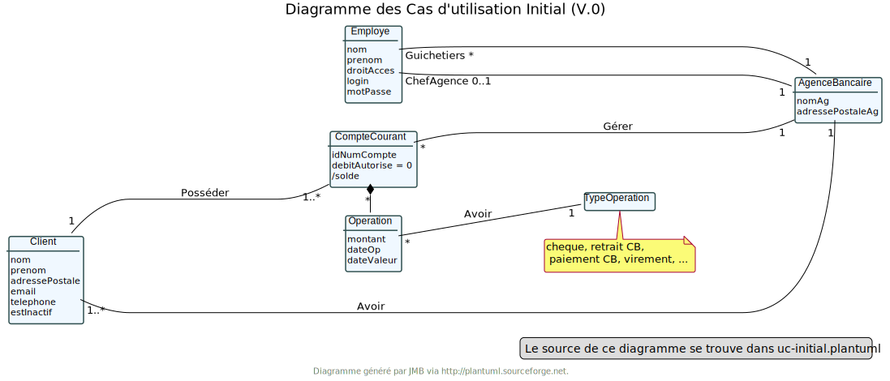
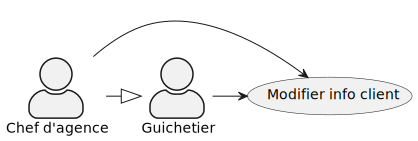
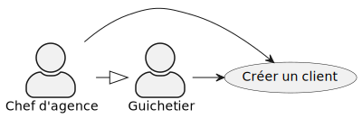
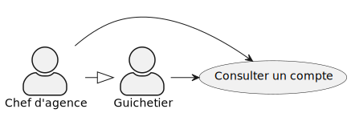
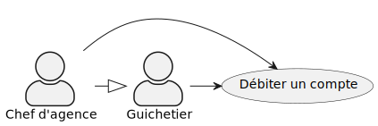

= Documentation technique V0 :
Thomas Falsimagne, Tilian Hure, Maxime Dourlent
v1.0, 2022-04-21

== I. Présentation de l'application :

=== 1. Use Case Global :

[.text-justify]
Voici le Use Case Global de la V0 de l'application DailyBank.
Il y a deux types d'utilisateurs, les guichetiers et les chefs d'agence.
Selon que l'utilisateur soit guichetier ou chef d'agence, il a des droits d'administration qui sont différents.
[.text-justify]
Un guichetier peut modifier les informations d'un client, créer un nouveau client, consulter un compte et débiter un compte.
Un chef d'agence peut faire toutes ces actions et peut en plus rendre inactif un client.

=== II. Diagramme de classe des données global :

== III. Architecture :

=== 1. Architecture générale

[.text-justify]
Pour l'application de la banque DailyBank, l'architecture générale est assez simple.
l'application est basée sur un fonctionnement centralisé, avec des postes de travails
qui sont directement reliés à une base de données.

[.text-justify]
Ces postes de travails sont les ordinateurs où travaillent les employés et les chefs d'agence.
Concernant la base de données, elle permet de stocker toutes les informations relatives à l'agence bancaire.
Que ce soit les informations des employés, des clients, des comptes et des opérations.

=== 2. Ressources externes :
==== 2.1. Librairies utilisées :

[.text-justify]
Au niveau des librairies, le code de l'application repose sur une librairie qui permet de lier l'application à la base de données. +
Cette librairie est : *objdbc6.jar*

[.text-justify]
L'application est généré en .jar, jar qui est de type "ojdbc6" et qui permet de lancer DailyBankApp sans
prérequis, simplement une JRE.

[.text-justify]
Il faut donc s'assurer que les postes de travail des employés possèdent une JRE 1.8 pour pouvoir faire fonctionner
le .jar sans encombre.

=== 3. Structuration de l'application :
[.text-justify]
Le code de l'application est structuré en plusieurs packages.
Les packages Model, View, Controller et Tools.
[.text-justify]
Le principe retenu qui a conduit à cette structuration est le MCV pattern.

src
    ├── application
    │   ├── control
    │   ├── tools
    │   └── view
    └── model
        ├── data
        └── orm
            └── exception

[.text-justify]
Modèle-vue-contrôleur ou MVC est un motif d'architecture logiciel destiné aux interfaces graphiques lancé en 1978 et très populaire pour les applications web. Le motif est composé de trois types de modules ayant trois responsabilités différentes : les modèles, les vues et les contrôleurs.

=== 4. Éléments essentiels :

[.text-justify]
Si le code de l'application devait être repris pour être amélioré ou modifié, le développeur devra avoir au préalable
une JRE version 1.8.
Il faudra ensuite qu'il ait pour environnement de développement le logiciel Eclipse.
Il devra également avoir un Workspace configuré en JavaFX avec le logiciel SceneBuilder intégré dans le buildpath.

== IV. Description et explication des fonctionnalités implémentées :

=== 1. Guichetier

==== 1.1 Modifier info client :

le guichetier peut modifier les informations du client. Il peut donc modifier le nom du client, son adresse, etc.

===== Use case correspondant :

==== 1.2 Créer un client :

Il est également possible pour lui de créer un nouveau client.

===== Use case correspondant :

==== 1.3 Consulter un compte :

Le guichetier peut également consulter un compte.

===== Use case correspondant :

==== 1.4 Débiter un compte :

Il peut débiter un compte

===== Use case correspondant :

