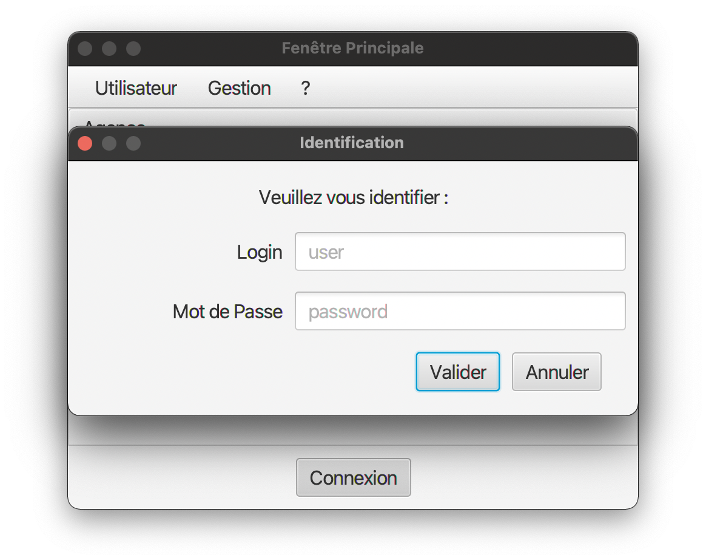

= Documentation Utilisateur - DailyBankApp (V1)
:toc:

Maxime DOURLENT, Thomas FALSIMAGNE et Tilian HURÉ +
Groupe *4A01*

== I. Présentation générale et rôle de l'application
[.text-justify]
Tout d'abord, notre travail aura été de concevoir une application pour la banque DailyBank, fonctionnelle et optimisée.

[.text-justify]
DailyBankApp a été conçue pour permettre aux guichetiers et aux chefs d'agence de gérer des comptes bancaires de dépôt de clients préalablement créés. Elle permet donc de créditer et débiter un compte, soit par virement, c'est-à-dire un échange d'argent entre deux comptes distincts, mais domiciliés dans le réseau bancaire, soit par une personne physique se présentant devant son guichet.

== II. Installation et utilisation
[.text-justify]
Concernant l'installation de l'application et son utilisation, l'utilisateur aura besoin de certains prérequis.

[.text-justify]
En effet, il sera indispensable de disposer d'un environnement d'exécution Java en version 8 (JRE 1.8), pour pouvoir exécuter l'application. +
 +

Référence : https://www.java.com/fr/download/manual.jsp +
 +
[.text-justify]
Cette version devra être installée et configurée dans le terminal, par exemple avec *jenv* sur Mac et Linux, ou une alternative sur Windows. +
 +

Référence : https://www.jenv.be/ +
 +
[.text-justify]
Une fois la configuration terminée, il vous faudra installer l'application qui sera un fichier .jar exécutable. +

Pour l'exécuter, il vous faudra aller dans le terminal et exécuter la commande :

[source]
java - jar DailyBank.jar

== III. Fonctionnement de DailyBankApp
=== 1. Connexion à l'application :
[.text-justify]
À l'ouverture de l'application, vous vous trouverez face à cette fenêtre :

image:images/DocumentationUser/login.png[login, 600, 500]

[.text-justify]
Il vous suffit d'appuyer sur le bouton "Connexion" pour voir apparaître une page de connexion.

[.text-justify]
Après avoir renseigné vos informations de connexion, vous pourrez accéder aux fonctionnalités de l'application.

image:images/DocumentationUser/mainPage.png[mainPage, 600, 500]

[.text-justify]
Il est possible de se connecter en tant que *Guichetier* ou *Chef d'agence*. Les deux utilisateurs ont la possibilité de gérer des clients mais seuls les chefs d'agence peuvent gérer des employés.

[.text-justify]
Si vous souhaitez vous déconnecter de l'application, il vous suffit d'appuyer sur le bouton "Déconnexion", présent sur la page principale.

{empty} +

=== 2. Fonctionnalités des guichetiers :
==== 2.1 Gestion des clients :
[.text-justify]
Si vous souhaitez gérer les clients de votre agence, il vous faut cliquer sur le bouton "Clients", que vous voyez ci-dessous.

[.text-justify]
Vous arriverez ainsi sur cet onglet, qui vous permettra de faire toutes sortes d'actions concernant les clients :

image:images/DocumentationUser/gestionC2.png[gestionClient2, 600, 500]

===== 2.1.1 Créer un client :
[.text-justify]
Pour pouvoir créer un client, il vous faut cliquer sur le bouton "Nouveau client", situé en bas à droite de la fenêtre.

image:images/DocumentationUser/gestionC2.png[gestionClient2, 600, 500]

[.text-justify]
Vous verrez s'afficher cette interface vous permettant de créer le client souhaité. Entrez les informations voulues puis cliquer sur "Ajouter" pour confirmer (tous les champs doivent être complétés).

image:images/DocumentationUser/gestionC3.png[gestionClient3, 600, 500]

===== 2.1.2 Rechercher un client :
[.text-justify]
À votre arrivée sur l'onglet de gestion du client, vous trouverez un onglet vide, comme ceci :

image:images/DocumentationUser/gestionC2.png[gestionClient2, 600, 500]

[.text-justify]
Si vous souhaitez rechercher un client en particulier, vous pourrez vous servir des deux zones de saisies situées en haut de la fenêtre. Si vous souhaitez simplement afficher tous les clients présents dans l'agence, il vous suffit d'appuyer directement sur le bouton "Rechercher".

[.text-justify]
Voici une recherche sans spécifications :

image:images/DocumentationUser/gestionC4.png[gestionClient4, 600, 500]

[.text-justify]
Voici une recherche avec spécifications :

===== 2.1.3 Voir les informations d'un client :
[.text-justify]
Il vous est possible de visualiser les informations d'un client même inactif. Pour cela, sélectionnez dans la liste des clients de l'agence, celui à visualiser, puis cliquez sur le bouton "Voir client".

image:images/DocumentationUser/voirCl1.png[voirClient, 600, 500]

===== 2.1.4 Modifier les informations d'un client :
[.text-justify]
Si vous souhaitez modifier les informations d'un client, il vous faut d'abord sélectionner dans la liste des clients de l'agence, celui à modifier, puis cliquer sur le bouton "Modifier client" situé dans la barre d'outils à droite de la fenêtre.

[.text-justify]
Vous verrez s'afficher cet onglet, il vous suffira de modifier les informations voulues et de les confirmer en appuyant sur "Modifier" :

===== 2.1.5 Rendre inactif un client :
[.text-justify]
Pour rendre inactif un client, vous devrez être connecté à l'application en tant que *chef d'agence*.

[.text-justify]
Si vous souhaitez rendre inactif un client, il vous faut ouvrir la fenêtre de modification après avoir sélectionné le client souhaité dans la liste des clients de l'agence, puis cocher la case "Inactif" en bas de la fenêtre.

image:images/inactifCheck.png[clientInactif, 600, 500]

[NOTE]
====
[.text-justify]
Vous ne pouvez désactiver un client que si tous les comptes bancaires de ce dernier sont clôturés.
====

[.text-justify]
Confirmer en suite la modification pour rendre le client inactif de manière permanente.

{empty} +

==== 2.2 Gestion des comptes bancaires :
[.text-justify]
Si vous souhaitez consulter les comptes d'un client, sélectionnez d'abord un client dans la fenêtre de gestion des clients, puis appuyez simplement sur le bouton "Comptes client".

[.text-justify]
Vous vous trouverez face à cet onglet qui vous affiche les informations des différents comptes bancaires d'un client :

image:images/DocumentationUser/consC1.png[gestionCompte1, 600, 500]

===== 2.2.1 Créer un compte bancaire :
[.text-justify]
Il vous est possible de créer un compte bancaire pour un client, pour cela, cliquez sur le bouton "Nouveau compte" dans le gestionnaire des comptes bancaires d'un client.

image:images/DocumentationUser/consC2.png[gestionCompte2, 600, 500]

[.text-justify]
Saisissez le découvert autorisé ainsi que le solde du nouveau compte (son premier crédit).

image:images/DocumentationUser/consC3.png[créerCompte, 600, 500]

[NOTE]
====
[.text-justify]
Il est évident que le solde de départ d'un compte ne peut êter négatif.
====

===== 2.2.2 Modifer un compte bancaire :
[.text-justify]
Il vous est possible de modifier le découvert autorisé d'un compte bancaire. Pour cela, cliquez sur le bouton "Modifier compte" dans le gestionnaire des comptes bancaires d'un client.

image:images/DocumentationUser/consC2.png[gestionCompte2, 600, 500]

[.text-justify]
Saisissez ensuite le nouveau découvert autorisé.

image:images/DocumentationUser/consC3.png[modifierCompte, 600, 500]

[NOTE]
====
[.text-justify]
Le découvert autorisé saisi ne peut être supérieur à la solde du compte concerné lorsque ce dernier est négatif.
====

===== 2.2.3 Clôturer un compte bancaire :
[.text-justify]
Si vous souhaitez clôturer un compte bancaire, il vous faut d'abord sélectionner le compte souhaité dans la liste des comptes d'un client.

[.text-justify]
Cliquez en suite sur le bouton "Clôturer compte" puis confirmez la clôturation.

image:images/DocumentationUser/cl2.png[cloturerCompte2, 600, 500]

[NOTE]
====
[.text-justify]
Pour clôturer un compte vos devez d'abord vous assurer que son solde est nul, sinon l'opération ne sera pas possible.
====

{empty} +

[.text-justify]
Il vous est possible d'enregistrer des opérations de crédit, de débit et de virement sur le compte bancaire d'un client si ce dernier n'est pas clôturé.

[.text-justify]
Ici, le compte est ouvert, il est donc possible d'y réaliser des opérations.

===== 2.2.4 Consulter les opérations d'un compte :
[.text-justify]
Il vous est possible de voir les opérations réalisées sur le compte bancaire d'un client, même une fois clôturé. Pour cela, sélectionnez le compte bancaire souhaité dans la liste des comptes d'un client, puis cliquez sur le bouton "Voir opérations".

image:images/DocumentationUser/consC2.png[gestionCompte2, 600, 500]

[.text-justify]
Vous pouvez ainsi consulter les différentes opérations réalisées sur le compte sélectionné.

image:images/DocumentationUser/consC3.png[gestionCompte3, 600, 500]

[.text-justify]
Il vous est possible d'enregistrer des opérations de crédit, de débit et de virement sur le compte bancaire d'un client si ce dernier n'est pas clôturé.

[.text-justify]
Ici, le compte est ouvert, il est donc possible d'y réaliser des opérations.

===== 2.2.5 Créditer un compte client :
Si vous souhaitez créditer le compte bancaire d'un client, appuyez sur "Enregistrer crédit" dans la fenêtre de gestion des opérations d'un compte bancaire d'un client.

image:images/DocumentationUser/cr1.png[créditer, 600, 500]

Sur la fenêtre qui s'ouvrira, il vous sera possible de choisir le type d'opération de crédit en cliquant sur "Dépôt Espèces" (opération par défaut) et en saisissant un montant. Pour confirmer le crédit, appuyez sur "Effectuer crédit".

image:images/DocumentationUser/cr2.png[créditer2, 600, 500]

===== 2.2.6 Débiter un compte client :
Si vous souhaitez débiter le compte bancaire d'un client, appuyez sur "Enregistrer débit" dans la fenêtre de gestion des opérations d'un compte bancaire d'un client.

image:images/DocumentationUser/db1.png[débiter, 600, 500]

Sur la fenêtre qui s'ouvrira, il vous sera possible de choisir le type d'opération de débit en cliquant sur "Retrait Espèce" (opération par défaut) et en saisissant un montant. Pour confirmer le débit, appuyez sur "Effectuer débit".

==== 3.4 Effectuer un virement de compte à compte :
Si vous souhaitez réaliser un virement de compte à compte appuyez sur "Enregistrer virement" dans la fenêtre de gestion des opérations d'un compte bancaire d'un client.

image:images/DocumentationUser/vr1.png[virement, 600, 500]

Sur la fenêtre qui s'ouvrira, il vous faudra choisir le compte de destination et à saisir un montant. Pour confirmer le virement, appuyez sur "Effectuer virement".

{empty} +

=== 4. Fonctionnalités des chefs d'agence :
==== 4.1 Gestion des employés :
[.text-justify]
Pour accéder aux fonctionnalités suivante vous devrez être connecté à l'application en tant que *chef d'agence*.

[.text-justify]
Si vous souhaitez gérer les employés de votre agence, il vous faut cliquer sur le bouton "Employés", que vous voyez ci-dessous :

[.text-justify]
Vous arriverez ainsi sur cet onglet, qui vous permettra de faire toutes sortes d'actions concernant les employés :

image:images/DocumentationUser/gEmp2.png[gérerEmployé2, 600, 500]

===== 4.1.1 Créer un employé :
[.text-justify]
Pour pouvoir créer un employé, il vous faut cliquer sur le bouton "Nouvel employé", situé en bas à droite de la fenêtre.

image:images/DocumentationUser/gEmp2.png[gérerEmployé2, 600, 500]

[.text-justify]
Vous verrez s'afficher cette interface vous permettant de créer l'employé souhaité. Entrez les informations voulues puis cliquer sur "Ajouter" pour confirmer (tous les champs doivent être complétés).

image:images/DocumentationUser/rEmp3.png[gérerEmployé3, 600, 500]

==== 4.1.2 Rechercher un employé :
[.text-justify]
À votre arrivée sur l'onglet de gestion de l'employé, vous trouverez un onglet vide, comme ceci :

image:images/DocumentationUser/gEmp2.png[gérerEmployé2, 600, 500]

[.text-justify]
Si vous souhaitez rechercher un employé en particulier, vous pourrez vous servir des deux zones de saisies situées en haut de la fenêtre. Si vous souhaitez simplement afficher tous les employés présents dans l'agence, il vous suffit d'appuyer directement sur le bouton "Rechercher".

[.text-justify]
Voici une recherche sans spécifications :

image:images/DocumentationUser/rEmp1.png[gérerEmployé1, 600, 500]

[.text-justify]
Voici une recherche avec spécifications :

image:images/DocumentationUser/rEmp2.png[gérerEmployé2, 600, 500]

==== 4.1.3 Voir les informations d'un employé :
[.text-justify]
Il vous est possible de visualiser les informations d'un employé même inactif. Pour cela, sélectionnez dans la liste des employés de l'agence, celui à visualiser, puis cliquez sur le bouton "Voir employé".

image:images/DocumentationUser/voirInfosEmpl.png[voirEmployé, 600, 500]

==== 4.1.4 Modifier les informations d'un employé :
[.text-justify]
Si vous souhaitez modifier les informations d'un employé, il vous faut d'abord sélectionner dans la liste des employés de l'agence, celui à modifier, puis cliquer sur le bouton "Modifier employé" situé dans la barre d'outils à droite de la fenêtre.

[.text-justify]
Vous verrez s'afficher cet onglet, il vous suffira de modifier les informations voulues et de les confirmer en appuyant sur "Modifier" :

image:images/DocumentationUser/rEmp5.png[gérerEmployé5, 600, 500]

==== 4.1.5 Rendre inactif un employé :
[.text-justify]
Si vous souhaitez rendre inactif un employé, il vous faut ouvrir la fenêtre de modification après avoir sélectionné l'employé souhaité dans la liste des employés de l'agence, puis cocher la case "Inactif" en bas de la fenêtre.

image:images/inactifEmplCheck.png[employéInactif, 600, 500]

[.text-justify]
Confirmer en suite la modification pour rendre le client inactif de manière permanente.

== IV. Résultats produits avec jeux d'essai commentés
[.text-justify]
[blue]#Pour ce qui est des résultats produits avec des jeux d'essai commentés, merci de bien vouloir vous référer au *cahier de recette*.#
