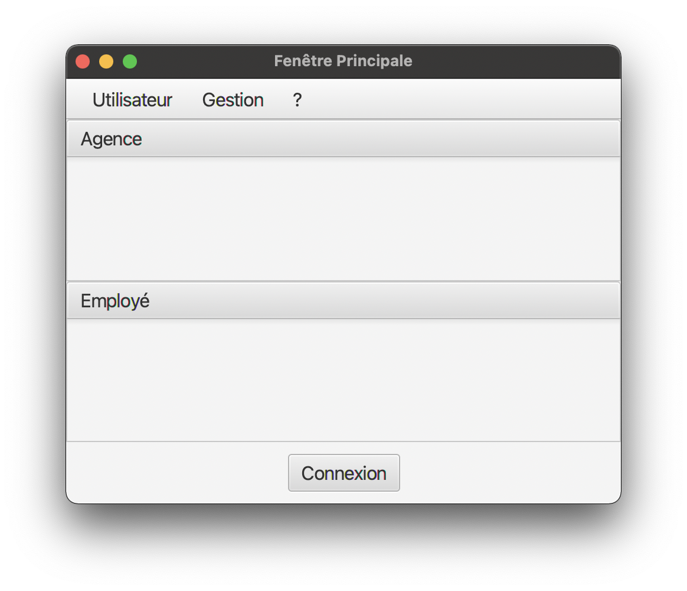

= Documentation utilisateur V0 :
Thomas Falsimagne, Tilian Hure, Maxime Dourlent
v1.0, 2022-04-21

:toc:
:numbered:

[.text-justify]
== Présentation générale, rôle de l'application : 

Tout d'abord, notre travail aura été de concevoir une application pour la banque DailyBank, fonctionnelle et optimisée.

DailyBankApp a été conçue pour permettre aux guichetiers et aux chefs d'agence de gérer des comptes bancaires de dépôt de clients préalablement créés. Elle permet donc de créditer et débiter un compte, soit par virement, c'est à dire un échange d'argent entre deux comptes distincts mais domiciliés dans le réseau bancaire, soit par une personne physique se présentant devant son guichet.

[.text-justify]
== Installation et utilisation :
[.text-justify]
Concernant l'installation de l'application et son utilisation, l'utilisateur aura besoin de certains prérequis.

En effet, il sera indispensable de disposer d'un environnement d'exécution Java en version 8 (JRE 1.8), pour pouvoir exécuter l'application.

Référence : https://www.java.com/fr/download/manual.jsp

Cette version devra être installée et configurée dans le terminal, par exemple avec jenv sur Mac et Linux, ou une alternative sur Windows.

Référence : https://www.jenv.be/

Une fois la configuration terminée, il vous faudra installer l'application qui sera un fichier .jar exécutable. +

Pour l'exécuter, il vous faudra aller dans le terminal et exécuter la commande :

	java - jar DailyBank.jar 

[.text-justify]
== Fonctionnement de DailyBankApp :

==== Connexion à l'application :

L'utilisateur se trouvera à l'ouverture de l'application, en face de cette fenêtre :

Il lui suffira d'appuyer sur le bouton "Connexion" et de rentrer ses informations de connexion pour pouvoir accéder à l'application.

== Résultats produits avec jeux d'essai commentés :
