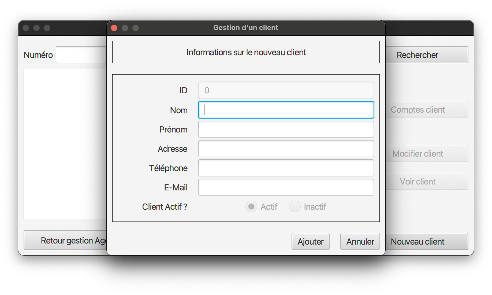
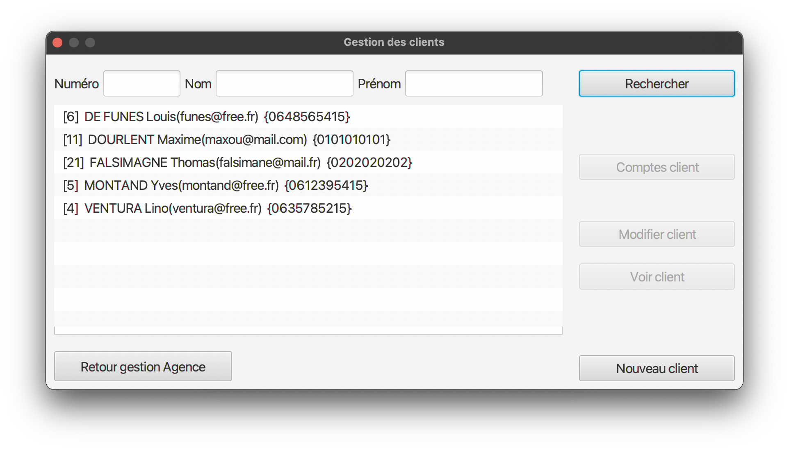
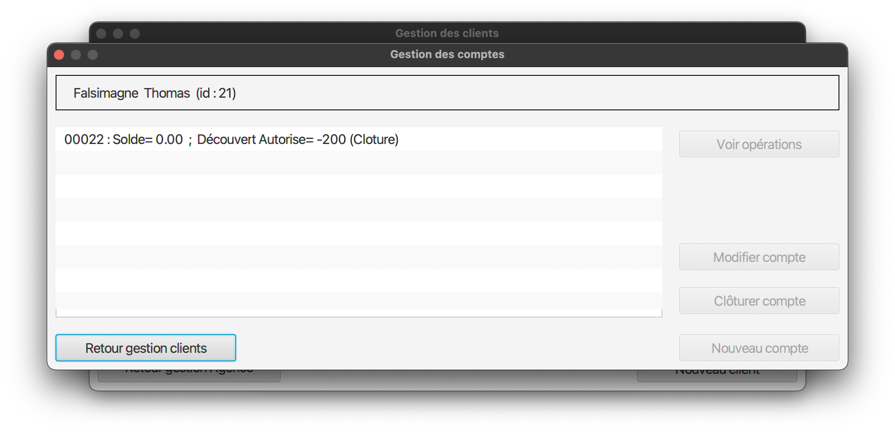
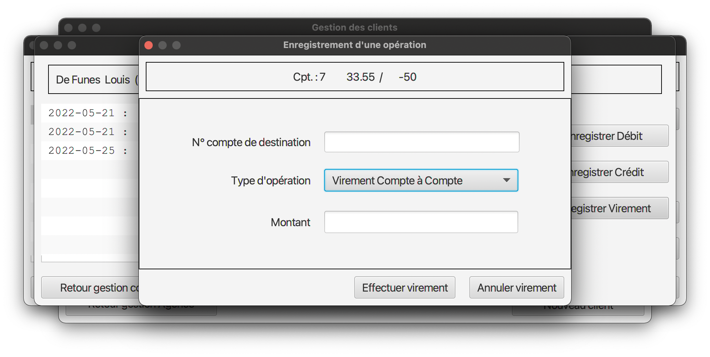
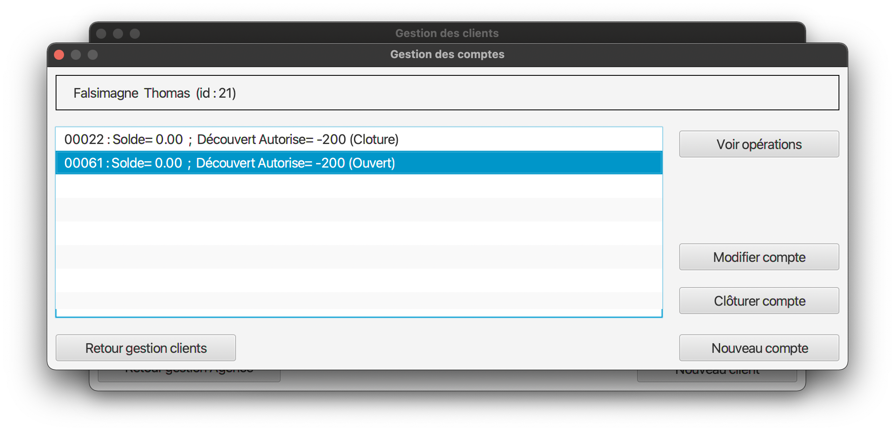
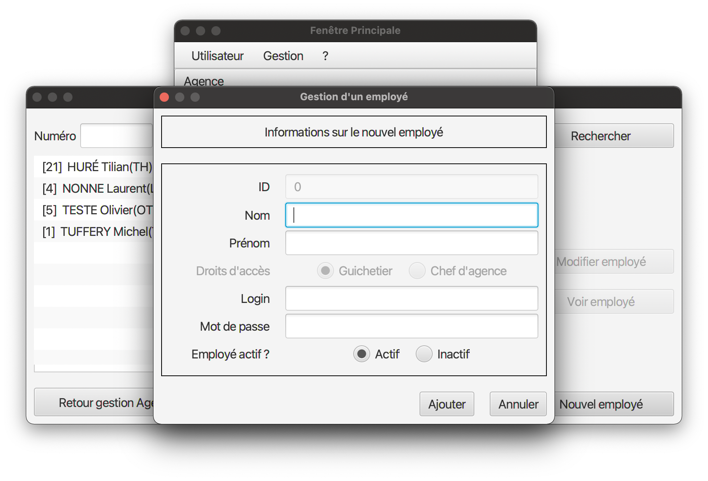
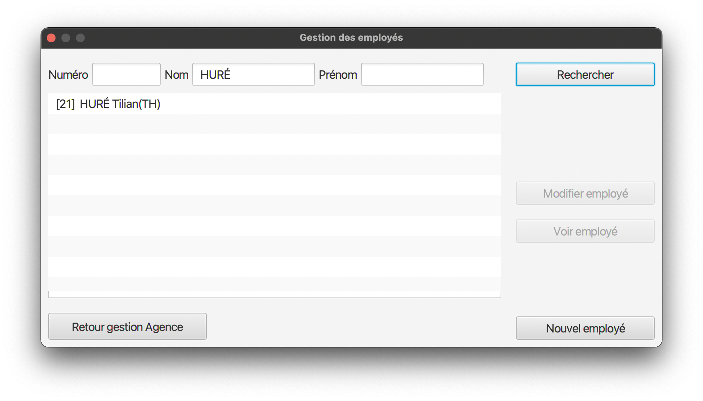
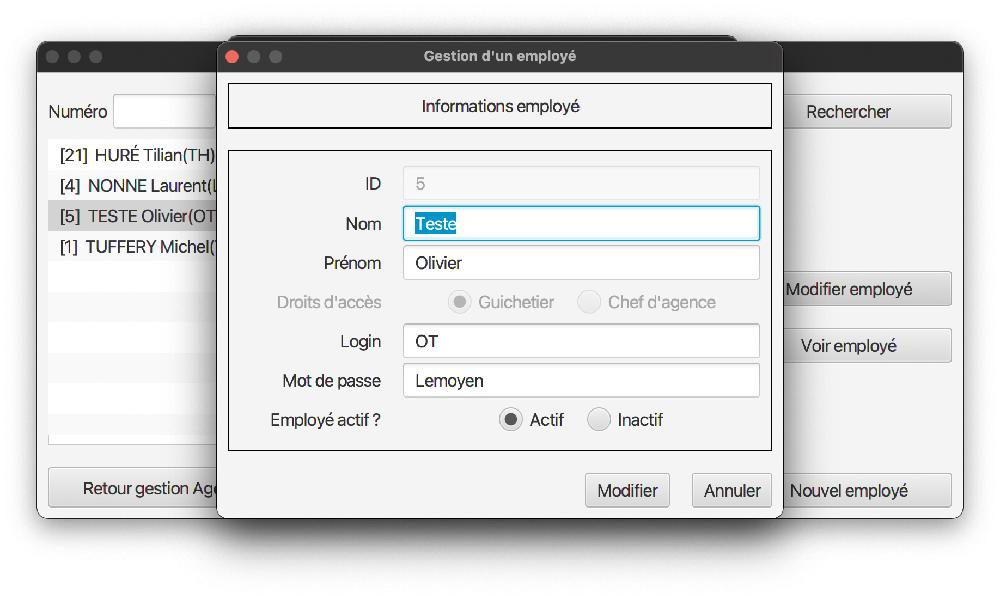

= Documentation utilisateur V0 :
:toc:
:numbered:

*_Thomas Falsimagne, Tilian Hure, Maxime Dourlent_*

[.text-justify]
== Présentation générale, rôle de l'application : 

Tout d'abord, notre travail aura été de concevoir une application pour la banque DailyBank, fonctionnelle et optimisée.

DailyBankApp a été conçue pour permettre aux guichetiers et aux chefs d'agence de gérer des comptes bancaires de dépôt de clients préalablement créés. Elle permet donc de créditer et débiter un compte, soit par virement, c'est-à-dire un échange d'argent entre deux comptes distincts, mais domiciliés dans le réseau bancaire, soit par une personne physique se présentant devant son guichet.

[.text-justify]
== Installation et utilisation :
[.text-justify]
Concernant l'installation de l'application et son utilisation, l'utilisateur aura besoin de certains prérequis.

En effet, il sera indispensable de disposer d'un environnement d'exécution Java en version 8 (JRE 1.8), pour pouvoir exécuter l'application.

Référence : https://www.java.com/fr/download/manual.jsp

Cette version devra être installée et configurée dans le terminal, par exemple avec *jenv* sur Mac et Linux, ou une alternative sur Windows.

Référence : https://www.jenv.be/

Une fois la configuration terminée, il vous faudra installer l'application qui sera un fichier .jar exécutable. +

Pour l'exécuter, il vous faudra aller dans le terminal et exécuter la commande :

	java - jar DailyBank.jar 

[.text-justify]
== Fonctionnement de DailyBankApp :

=== Connexion à l'application :
[.text-justify]
Vous vous trouverez, à l'ouverture de l'application, face à cette fenêtre.

image:images/DocumentationUser/login.png[]
[.text-justify]
Il vous suffit d'appuyer sur le bouton connexion pour voir apparaître la page de connexion.

image:images/DocumentationUser/connexionPage.png[]
[.text-justify]
Après avoir rentré vos informations de connexion, vous serez amené sur cette page :

image:images/DocumentationUser/mainPage.png[]
[.text-justify]
Vous voilà connecté à l'application DailyBank, bravo !

=== Déconnexion de l'application :
[.text-justify]
Si vous souhaitez vous déconnecter de l'application, il vous suffit d'appuyer sur le bouton "Déconnexion", présent sur la page principale.

=== Gestion des clients :

image:images/DocumentationUser/gestionC1.png[]
[.text-justify]
Si vous souhaitez gérer les clients de votre agence, il vous faut cliquer sur le bouton "Clients", que vous voyez ci-dessus.

image:images/DocumentationUser/gestionC2.png[]
[.text-justify]
Vous arriverez ainsi sur cet onglet, qui vous permettra de faire toutes sortes d'actions.

==== Créer un client :

image:images/DocumentationUser/gestionC2.png[]

Pour pouvoir créer un client, il vous faut cliquer sur le bouton "Nouveau Client", situé en bas à droite de votre fenêtre.

Vous verrez s'afficher cette interface vous permettant de créer le client souhaité. Entrez les informations voulues et cliquer sur "Ajouter" pour confirmer.

====
À savoir qu'il faut remplir tous les champs pour que l'ajout soit accepté.
====

==== Rechercher un client :

image:images/DocumentationUser/gestionC2.png[]
[.text-justify]
À votre arrivée sur l'onglet de gestion du client, vous trouverez un onglet vide, comme ceci.
[.text-justify]
Si vous souhaitez rechercher un client en particulier, vous pourrez vous servir des deux zones de saisies situées en haut de la fenêtre. Si vous souhaitez simplement rechercher tous les clients présents dans l'agence, il vous suffit d'appuyer sur le bouton "Rechercher".

[.text-justify]
Voici une recherche sans spécifications.

image:images/DocumentationUser/gestionC5.png[]
[.text-justify]
Voici une recherche avec spécifications.

==== Modifier les informations d'un client :

image:images/DocumentationUser/gestionC6.png[]
[.text-justify]
Si vous souhaitez modifier les informations d'un client,
il vous faut cliquer sur le bouton "Modifier client", situé dans la barre d'outils à droite de la fenêtre.

image:images/DocumentationUser/gestionC7.png[]
[.text-justify]
Vous verrez s'afficher cet onglet, il vous suffira de modifier les informations voulues et de les confirmer en appuyant sur "Modifier".

==== Voir les informations d'un client :

Pour pouvoir avoir un aperçu des informations d'un client, il vous faut tout d'abord aller sur l'onglet de gestion client. Ensuite, il vous faut le sélectionner, certaines actions seront donc activées.

Ensuite, appuyez sur le bouton "Voir client". Vous aurez un aperçu qui ressemblera à celui-ci.

image:images/DocumentationUser/voirCl1.png[]

=== Gestion des comptes bancaires :

image:images/DocumentationUser/gestionC6.png[]
[.text-justify]
Si vous souhaitez consulter les comptes d'un client, appuyez simplement sur le bouton "Comptes client"

[.text-justify]
Vous vous trouverez face à cet onglet qui vous affiche les informations des différents comptes d'un client.

==== Consulter les opérations d'un compte :

image:images/DocumentationUser/consC2.png[]
[.text-justify]
En cliquant sur le compte voulu, il vous est possible de voir les opérations réalisées sur celui-ci, qu'il soit clôturé ou non. Pour cela, cliquez sur le bouton "Voir opérations".

image:images/DocumentationUser/consC3.png[]
[.text-justify]
Vous pouvez ainsi consulter les différentes opérations réalisées avec le compte d'un client.

==== Créditer un compte client :

image:images/DocumentationUser/consC4.png[]
[.text-justify]
Si le compte que vous souhaitez créditer est noté comme ouvert (inscrit ainsi entre parenthèses sur la ligne du compte), alors cela est possible. À contrario, s'il est inscrit sur la ligne qu'il est clôturé, alors ce ne sera pas possible.

image:images/DocumentationUser/cr1.png[]

Ici, le compte est ouvert, il est donc possible de réaliser des opérations sur celui-ci.

Si vous souhaitez créditer le compte, appuyez sur "Enregistrer Crédit".

image:images/DocumentationUser/cr2.png[]

Ici, vous aurez le choix, vous pourrez choisir le type d'opération en cliquant sur "Dépôt Espèces" (opération par défaut) et inscrire un montant. Pour confirmer le crédit, appuyez sur "Effectuer Crédit", sinon, appuyez sur "Annuler Crédit".

==== Débiter un compte client :

image:images/DocumentationUser/consC4.png[]
[.text-justify]
Si le compte que vous souhaitez débiter est noté comme ouvert (inscrit ainsi entre parenthèses sur la ligne du compte), alors cela est possible. À contrario, s'il est inscrit sur la ligne qu'il est clôturé, alors ce ne sera pas possible.
[.text-justify]
Ici, le compte est ouvert, il est donc possible de réaliser des opérations sur celui-ci.
[.text-justify]
Si vous souhaitez créditer le compte, appuyez sur "Enregistrer Débit".

image:images/DocumentationUser/db1.png[]
[.text-justify]
Ici, vous aurez le choix, vous pourrez choisir le type d'opération en cliquant sur "Retrait Espèces" (opération par défaut) et inscrire un montant. Pour confirmer le débit, appuyez sur "Effectuer Débit", sinon, appuyez sur "Annuler Débit".

==== Effectuer un virement depuis un compte client :

image:images/DocumentationUser/consC4.png[]
[.text-justify]
Si le compte que vous souhaitez débiter est noté comme ouvert (inscrit ainsi entre parenthèses sur la ligne du compte), alors cela est possible. À contrario, s'il est inscrit sur la ligne qu'il est clôturé, alors ce ne sera pas possible.
[.text-justify]
Ici, le compte est ouvert, il est donc possible de réaliser des opérations sur celui-ci.
[.text-justify]
Si vous souhaitez créditer le compte, appuyez sur "Enregistrer Virement".

[.text-justify]
Ici, il vous faut rentrer le n° de compte de destination et le montant que vous souhaitez virer depuis le compte client. Pour confirmer le virement, appuyez sur "Effectuer Virement", sinon, appuyez sur "Annuler Virement".

==== Clôturer un compte bancaire :
[.text-justify]
Si vous souhaitez clôturer un compte bancaire, il vous faut tout d'abord aller sur l'onglet de gestion des comptes.

image:images/DocumentationUser/cl1.png[]
[.text-justify]

[.text-justify]
Ensuite, en choisissant un compte, vous aurez la possibilité de le clôturer avec le bouton "Clôturer compte". Il faut au préalable que celui-ci soit "Ouvert" (noté entre parenthèses), et que son solde soit nul, sinon un message d'erreur sera affiché.

image:images/DocumentationUser/cl3.png[]
[.text-justify]
Ici, si vous voulez clôturer le compte bancaire, cliquez sur le bouton "Yes", sinon cliquez sur le bouton "No".

=== Gestion des employés :
[.text-justify]
Cette partie est réservée aux chefs d'agence. Pour pouvoir gérer les employés, il vous faut en effet être connecté sous ce statut.

image:images/DocumentationUser/gEmp1.png[]
[.text-justify]
Tout d'abord, il vous faut aller sur l'onglet de gestion des employés. Comme sur l'image ci-dessus, cliquez sur le bouton "Gestion", sur le haut de la fenêtre et ensuite sur "Employés".

image:images/DocumentationUser/gEmp2.png[]
[.text-justify]
Ici, vous arrivez sur la page de gestion des employés.

==== Créer un employé :

image:images/DocumentationUser/gEmp2.png[]

Pour pouvoir créer un employé, il vous faut cliquer sur le bouton "Nouvel employé", situé en bas à droite de votre fenêtre.

Vous verrez s'afficher cette interface vous permettant de créer l'employé souhaité. Entrez les informations voulues et cliquer sur "Ajouter" pour confirmer.

====
À savoir qu'il faut remplir tous les champs pour que l'ajout soit accepté.
====

==== Rechercher un employé :

image:images/DocumentationUser/gEmp2.png[]
[.text-justify]
À votre arrivée sur l'onglet de gestion des employés, vous trouverez un onglet vide, comme ceci.
[.text-justify]
Si vous souhaitez rechercher un employé en particulier, vous pourrez vous servir des deux zones de saisies situées en haut de la fenêtre. Si vous souhaitez simplement rechercher tous les employés présents dans l'agence, il vous suffit d'appuyer sur le bouton "Rechercher".

image:images/DocumentationUser/rEmp1.png[]

[.text-justify]
Voici une recherche sans spécifications.

[.text-justify]
Voici une recherche avec spécifications.

==== Modifier les informations d'un employé :

image:images/DocumentationUser/gEmp2.png[]
[.text-justify]
Si vous souhaitez modifier les informations d'un employé, il vous faut tout d'abord en avoir sélectionné un.

image:images/DocumentationUser/rEmp4.png[]

Ensuite, il vous faut cliquer sur le bouton "Modifier employé", situé dans la barre d'outils à droite de la fenêtre.

[.text-justify]
Vous verrez s'afficher cet onglet, il vous suffira de modifier les informations voulues et de les confirmer en appuyant sur "Modifier".

==== Voir les informations d'un employé :

Pour pouvoir avoir un aperçu des informations d'un employé, il vous faut tout d'abord aller sur l'onglet de gestion employé. Ensuite, il vous faut le sélectionner, certaines actions seront donc activées.

image:images/DocumentationUser/rEmp4.png[]

Ensuite, appuyez sur le bouton "Voir client". Vous aurez un aperçu qui ressemblera à celui-ci. Cliquez sur le bouton "Fermer" si vous souhaitez quitter l'onglet.

r

== Résultats produits avec jeux d'essai commentés :
