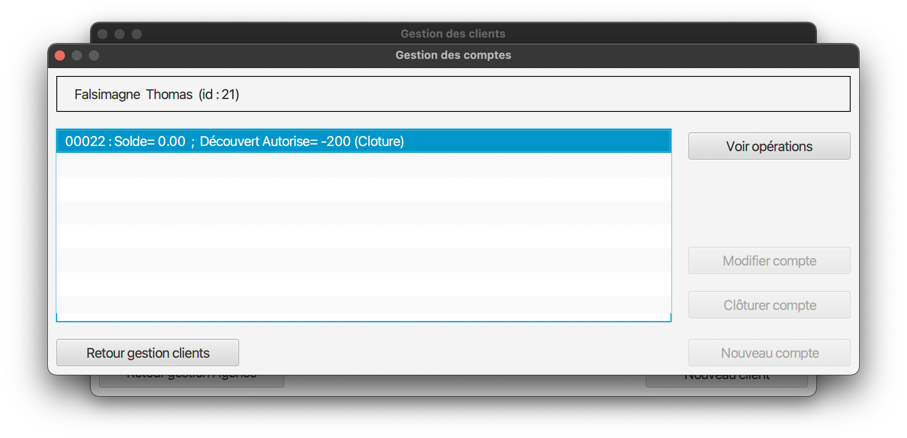

= Documentation Utilisateur (V1)

:toc:

Maxime DOURLENT, Thomas FALSIMAGNE et Tilian HURÉ +
Groupe *4A01*

== I. Présentation générale et rôle de l'application
[.text-justify]
Tout d'abord, notre travail aura été de concevoir une application pour la banque DailyBank, fonctionnelle et optimisée.

[.text-justify]
DailyBankApp a été conçue pour permettre aux guichetiers et aux chefs d'agence de gérer des comptes bancaires de dépôt de clients préalablement créés. Elle permet donc de créditer et débiter un compte, soit par virement, c'est-à-dire un échange d'argent entre deux comptes distincts, mais domiciliés dans le réseau bancaire, soit par une personne physique se présentant devant son guichet.

== II. Installation et utilisation
[.text-justify]
Concernant l'installation de l'application et son utilisation, l'utilisateur aura besoin de certains prérequis.

[.text-justify]
En effet, il sera indispensable de disposer d'un environnement d'exécution Java en version 8 (JRE 1.8), pour pouvoir exécuter l'application. +
 +

Référence : https://www.java.com/fr/download/manual.jsp +
 +
[.text-justify]
Cette version devra être installée et configurée dans le terminal, par exemple avec *jenv* sur Mac et Linux, ou une alternative sur Windows. +
 +

Référence : https://www.jenv.be/ +
 +
[.text-justify]
Une fois la configuration terminée, il vous faudra installer l'application qui sera un fichier .jar exécutable. +

Pour l'exécuter, il vous faudra aller dans le terminal et exécuter la commande :

[source]
java - jar DailyBank.jar

== IV. Fonctionnement de DailyBankApp
=== 1. Connexion à l'application :
[.text-justify]
À l'ouverture de l'application, vous vous trouverez face à cette fenêtre :

image:images/DocumentationUser/login.png[]

[.text-justify]
Il vous suffit d'appuyer sur le bouton "Connexion" pour voir apparaître une page de connexion.

image:images/DocumentationUser/connexionPage.png[]

[.text-justify]
Après avoir renseigné vos informations de connexion, vous pourrez accéder aux fonctionnalités de l'application.

image:images/DocumentationUser/mainPage.png[]

[NOTE]
====
[.text-justify]
Il est possible de se connecter en tant que Guichetier ou Chef d'agence. Les deux utilisateurs ont la possibilité des clients mais seuls les chefs d'agence peuvent gérer des employés.
====

[.text-justify]
Si vous souhaitez vous déconnecter de l'application, il vous suffit d'appuyer sur le bouton "Déconnexion", présent sur la page principale.

{empty} +

=== 2. Gestion des clients :
[.text-justify]
Si vous souhaitez gérer les clients de votre agence, il vous faut cliquer sur le bouton "Clients", que vous voyez ci-dessous.

image:images/DocumentationUser/gestionC1.png[]

[.text-justify]
Vous arriverez ainsi sur cet onglet, qui vous permettra de faire toutes sortes d'actions concernant les clients :

image:images/DocumentationUser/gestionC2.png[]

==== 2.1 Créer un client :
[.text-justify]
Pour pouvoir créer un client, il vous faut cliquer sur le bouton "Nouveau Client", situé en bas à droite de la fenêtre.

image:images/DocumentationUser/gestionC2.png[]

[.text-justify]
Vous verrez s'afficher cette interface vous permettant de créer le client souhaité. Entrez les informations voulues puis cliquer sur "Ajouter" pour confirmer (tous les champs doivent être complétés).

image:images/DocumentationUser/gestionC3.png[]

==== 2.2 Rechercher un client :
[.text-justify]
À votre arrivée sur l'onglet de gestion du client, vous trouverez un onglet vide, comme ceci :

image:images/DocumentationUser/gestionC2.png[]

[.text-justify]
Si vous souhaitez rechercher un client en particulier, vous pourrez vous servir des deux zones de saisies situées en haut de la fenêtre. Si vous souhaitez simplement afficher tous les clients présents dans l'agence, il vous suffit d'appuyer directement sur le bouton "Rechercher".

[.text-justify]
Voici une recherche sans spécifications :

image:images/DocumentationUser/gestionC4.png[]

[.text-justify]
Voici une recherche avec spécifications :

image:images/DocumentationUser/gestionC5.png[]

==== 2.3 Voir les informations d'un client :
[.text-justify]
Il vous est possible de visualiser les informations d'un client même inactif. Pour cela, sélectionnez dans la liste des clients de l'agence, celui à visualiser, puis cliquez sur le bouton "Voir client".

image:images/DocumentationUser/vc.png TODO

==== 2.4 Modifier les informations d'un client :
[.text-justify]
Si vous souhaitez modifier les informations d'un client, il vous faut d'abord sélectionner dans la liste des clients de l'agence, celui à modifier, puis cliquer sur le bouton "Modifier client" situé dans la barre d'outils à droite de la fenêtre.

image:images/DocumentationUser/gestionC6.png[]

[.text-justify]
Vous verrez s'afficher cet onglet, il vous suffira de modifier les informations voulues et de les confirmer en appuyant sur "Modifier" :

image:images/DocumentationUser/gestionC7.png[]

==== 2.5 Rendre inactif un client :

[NOTE]
====
[.text-justify]
Pour rendre inactif un client, vous devez être connecté à l'application en tant que chef d'agence.
====

[.text-justify]
Si vous souhaitez rendre inactif un client, il vous faut ouvrir la fenêtre de modification après avoir sélectionné le client souhaité dans la liste des clients de l'agence, puis cocher la case "Inactif" en bas de la fenêtre.

[NOTE]
====
[.text-justify]
Vous ne pouvez désactiver un client que si tous les comptes bancaires de ce dernier sont clôturés.
====

{empty} +

=== 3. Gestion des comptes bancaires :
[.text-justify]
Si vous souhaitez consulter les comptes d'un client, sélectionner un client dans la fenêtre appuyez simplement sur le bouton "Comptes client"

image:images/DocumentationUser/gestionC6.png[]

[.text-justify]
Vous vous trouverez face à cet onglet qui vous affiche les informations des différents comptes d'un client.

image:images/DocumentationUser/consC1.png[]

==== 3.1 Consulter les opérations d'un compte :
[.text-justify]
En cliquant sur le compte voulu, il vous est possible de voir les opérations réalisées sur celui-ci, qu'il soit clôturé ou non. Pour cela, cliquez sur le bouton "Voir opérations".

[.text-justify]
Vous pouvez ainsi consulter les différentes opérations réalisées avec le compte d'un client.

image:images/DocumentationUser/consC3.png[]

==== 3.2 Créditer un compte client :
[.text-justify]
Si le compte que vous souhaitez créditer est noté comme ouvert (inscrit ainsi entre parenthèses sur la ligne du compte), alors cela est possible. À contrario, s'il est inscrit sur la ligne qu'il est clôturé, alors ce ne sera pas possible.

image:images/DocumentationUser/consC4.png[]

Ici, le compte est ouvert, il est donc possible de réaliser des opérations sur celui-ci.

image:images/DocumentationUser/cr1.png[]

Si vous souhaitez créditer le compte, appuyez sur "Enregistrer Crédit".

image:images/DocumentationUser/cr2.png[]

Ici, vous aurez le choix, vous pourrez choisir le type d'opération en cliquant sur "Dépôt Espèces" (opération par défaut) et inscrire un montant. Pour confirmer le crédit, appuyez sur "Effectuer Crédit", sinon, appuyez sur "Annuler Crédit".

==== Débiter un compte client :

image:images/DocumentationUser/consC4.png[]
[.text-justify]
Si le compte que vous souhaitez débiter est noté comme ouvert (inscrit ainsi entre parenthèses sur la ligne du compte), alors cela est possible. À contrario, s'il est inscrit sur la ligne qu'il est clôturé, alors ce ne sera pas possible.
[.text-justify]
Ici, le compte est ouvert, il est donc possible de réaliser des opérations sur celui-ci.
[.text-justify]
Si vous souhaitez créditer le compte, appuyez sur "Enregistrer Débit".

image:images/DocumentationUser/db1.png[]
[.text-justify]
Ici, vous aurez le choix, vous pourrez choisir le type d'opération en cliquant sur "Retrait Espèces" (opération par défaut) et inscrire un montant. Pour confirmer le débit, appuyez sur "Effectuer Débit", sinon, appuyez sur "Annuler Débit".

==== Effectuer un virement depuis un compte client :

image:images/DocumentationUser/consC4.png[]
[.text-justify]
Si le compte que vous souhaitez débiter est noté comme ouvert (inscrit ainsi entre parenthèses sur la ligne du compte), alors cela est possible. À contrario, s'il est inscrit sur la ligne qu'il est clôturé, alors ce ne sera pas possible.
[.text-justify]
Ici, le compte est ouvert, il est donc possible de réaliser des opérations sur celui-ci.
[.text-justify]
Si vous souhaitez créditer le compte, appuyez sur "Enregistrer Virement".

image:images/DocumentationUser/vr1.png[]
[.text-justify]
Ici, il vous faut rentrer le n° de compte de destination et le montant que vous souhaitez virer depuis le compte client. Pour confirmer le virement, appuyez sur "Effectuer Virement", sinon, appuyez sur "Annuler Virement".

==== Clôturer un compte bancaire :
[.text-justify]
Si vous souhaitez clôturer un compte bancaire, il vous faut tout d'abord aller sur l'onglet de gestion des comptes.

image:images/DocumentationUser/cl1.png[]
[.text-justify]

image:images/DocumentationUser/cl2.png[]
[.text-justify]
Ensuite, en choisissant un compte, vous aurez la possibilité de le clôturer avec le bouton "Clôturer compte". Il faut au préalable que celui-ci soit "Ouvert" (noté entre parenthèses), et que son solde soit nul, sinon un message d'erreur sera affiché.

image:images/DocumentationUser/cl3.png[]

Ici, si vous voulez clôturer le compte bancaire, cliquez sur le bouton "Yes", sinon cliquez sur le bouton "No".

== Résultats produits avec jeux d'essai commentés :
