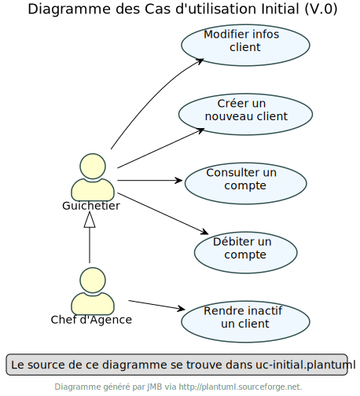
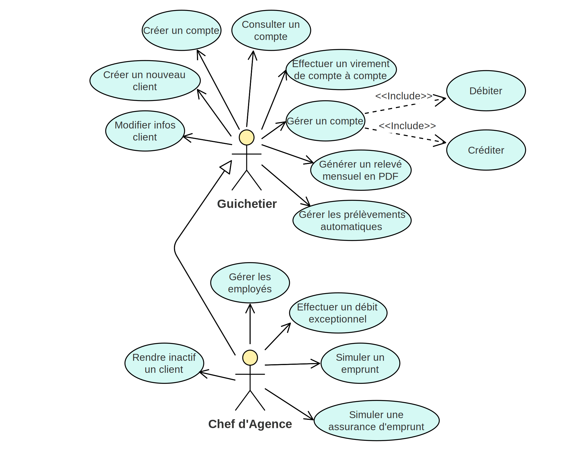

= Cahier Ces Charges Utilisateur - Version 1

ifdef::env-github[]
:tip-caption: :bulb:
:note-caption: :information_source:
:important-caption: :heavy_exclamation_mark:
:caution-caption: :fire:
:warning-caption: :warning:
:experimental:
:toc:
endif::[]

Équipe 4A01 : +
Maxime DOURLENT, Thomas FALSIMAGNE, Tilian HURÉ

[.text-justify]
== I. Contexte général
Pour s’adapter aux exigences d’instantanéité de leurs clients, les banques françaises ont accentué leurs efforts de restructuration et leurs investissements dans le digital. Cela se traduit principalement par des investissements majeurs dans la modernisation des outils de bureautique des guichetiers, et dans la robotisation des tâches automatisables. +
 +
 C'est notamment le cas de la banque DailyBank qui souhaite développer une application de gestion de ses comptes clients pour remplacer plusieurs des ses outils devenus obsolètes. +
 +

== II. Objectifs du projet
[.text-justify]
Les objectifs de ce projet sont de permettre à DailyBank de bénéficier d'une application de gestion de comptes bancaires de dépôt pour ses clients, afin de remplacer plusieurs outils obsolètes et restructurer certains services bancaires. +
 +

== III. Version existante (V0)
[.text-justify]
La version existante de l'application offre déjà un interface homme-machine ainsi qu'un partie du code implémentant les fonctionnalités déjà présentes. Il est possible d'interagir en tant que deux types d'utilisateurs.

=== 1. Les guichetiers :
[.text-justify]
Les guichetiers sont les principaux types d'utilisateurs de l'application. Leur rôle dans l'organisation consiste à gérer les clients ainsi que leurs comptes. +
 +
*Les guichetiers peuvent :*

* Modifier les informations client
* Créer un nouveau client
* Consulter un compte
* Débiter un compte

=== 2. Les chefs d'agence :
[.text-justify]
Les chefs d'agences interviennent en tant qu'administrateurs sur l'application. Leur rôle dans l'organisation consiste davantage à gérer les employés guichetiers et les autres chefs d'agence, mais ils peuvent également intervenir dans la gestion des clients et de leurs comptes. +
 +
*Les chefs d'agence peuvent :*

* Rendre inactif un client (bloquer tout interaction avec les données d'un client pour les utilisateurs guichetiers)

=== 3. Diagramme des cas d'utilisation initial :

[NOTE]
====
[.text-justify]
Les chefs d'agence sont des guichetiers avec des droits d'administration suplémentaires. Ils peuvent donc accèder à toutes les fonctionnalités des utilisateurs guichetiers, en plus de celles qui leurs sont spécifiques.
====

== IV. Description fonctionnelle des besoins actuels (V2)
[.text-justify]
La mission de notre équipe dans ce projet est de développer la version existante de l'application en y ajoutant les fonctionnalités décrites ci-dessous pour les deux types d'utilisateurs concernés.

=== 1. Fonctionnalités pour les utilisateurs guichetiers :
* Créditer / débiter un compte
* Créer un compte
* Effectuer un virement de compte à compte
* Clôturer un compte
* Générer un relevé mensuel d’un compte en PDF
* _Gérer*_ les prélèvements automatiques

=== 2. Fonctionnalités pour les utilisateurs chefs d'agence :
* _Gérer*_ les employés (guichetiers et autres chefs d’agence)
* Effectuer un Débit exceptionnel (TODO)
* Simuler un emprunt
* Simuler une assurance d’emprunt (possibilité de couverture en cas de maladie ou de décès)

[NOTE]
====
[.text-justify]
_Gérer_ désigne la possibilité de créer, consulter, modifier et supprimer des données sur l'application.
====

=== 3. Diagramme des cas d'utilisation actuel :

== V. Contraintes et organisation
[.text-justify]
Pour développer l'application dans son intégralité, plusieurs contraintes devront être respectées dont deux principaux types. Une bonne organisation de notre équipe sera également requise pour mener à bien le projet.

=== 1. Contraintes techniques :
[.text-justify]
Le développement de l'application présente principalement des contraintes techniques devant être respectées à la fois pour l'utilisation finale de cette dernière, mais aussi pour ses futures maintenances qui seront probablement réalisées par d'autres développeurs. +
 +
*Contraintes techniques actuelles :*

* Développer l'application en Java (version 1.8)
* Développer l'interface homme-machine existant avec Java FX
* Utiliser la base de données existante
* ... (TO COMPLETE)

=== 2. Contraites juridiques :
[.text-justify]
La banque DailyBank doit veiller à n'enfreindre aucune loi via son application. Chaque fonctionnalité devra donc respecter des contraintes juridiques précises. +
 +
*Contraintes juridiques actuelles :*

* TODO

=== 3. Organisation de l'équipe :
[.text-justify]
Notre équipe devra développer le projet en respectant les échéances données avec une organisation rigoureuse, en utilisant les outils adaptés, et en fournissant tous les fichiers et documents nécessaires à l'utilisation finale de l'application et à son développement dans le futur. +
 +
*Contraintes organisationnelles :*

* Échéances : fin de la semaine du 06/06 au 12/06 2022
* Outils collaboratifs :
** GitHub (planification des tâches et dépot de tous les fichiers et documents éllaborés)
** Discord (communication et travail en distanciel)
** ... (TO COMPLETE)
* Outils de développement :
** Eclipse (IDE) avec l'environnement Java 8 et le module Java FX
** SceneBuilder (structuration d'IHM)
** Atome (réalisation des documents complémentaires)
** Project Libre (diagramme de Gantt)
** ... (TO COMPLETE)
* Livrables attendus :
** Diagramme de Gantt (planification et répartition des tâches)
** Cahier des charges (modalités du projet)
** Documentation technique (pour une ré-utilisation externe à notre équipe du code source)
** Documentation utilisateur (description de l'installation et du fonctionnement de l'application pour ses utilisateurs)
** Cahier de tests (démonstration du bon fonctionnement de l'application)
** ... (TO COMPLETE)(?)
